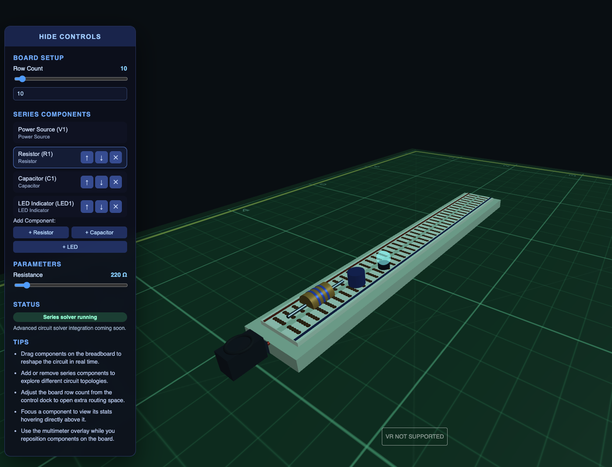

# VR Circuit Designer

A WebXR breadboard lab for experimenting with simple circuits in 3D/VR. The scene uses Three.js with a custom **CodexSpice** solver to drive live measurements, animated current flow, and interactive instrumentation.



## Features
- Expandable breadboard surface with snap-to-hole dragging for components.
- Component catalogue (source, resistor, capacitor, LED) with real-time parameter tuning.
- CodexSpice simulation core outputs live bus voltage/current and captures waveform history.
- Measurement wall hosting draggable multimeter and oscilloscope panels powered by the simulator.
- Red/black probes that can be placed on the breadboard to route instrument readings to specific components.
- Animated “current” along jumper traces plus emissive feedback on components to indicate activity.
- Desktop and VR interaction: drag components on the board, reposition probes/panels, or use VR controller rays.

## Getting Started
1. Install [Bun](https://bun.sh) (v1.0+) and install deps:
   ```sh
   bun install
   ```
2. Start the dev server:
   ```sh
   bun run dev
   ```
3. Open the reported URL in a WebXR-capable browser (Chrome, Edge, or Firefox with WebXR enabled) and click **Enter VR** (or explore in desktop mode).

## Controls & Tips
- **Board Dragging**: Click (or grip in VR) a component to snap it to new breadboard holes; segments can be added from the control dock.
- **2D Layout Map**: Drag nodes on the map for a top-down snap preview; it mirrors the breadboard grid.
- **Measurement Wall**: Grab the multimeter and waveform panels to reposition them around the workspace.
- **Probes**: Move the red (positive) and black (reference) probes onto components to route the multimeter and scope to that node.
- **Parameter Dock**: Adjust component values via sliders; CodexSpice immediately updates the scene and instruments.
- **VR Controllers**: Use trigger for selection/drag, grip to reposition yourself.

## Technology Notes
- The breadboard geometry is generated procedurally; new slot segments can be appended at runtime.
- CodexSpice models a simple DC supply feeding an RC/LED load with ripple and noise injection, outputs node stats, and records current waveform history.
- Canvas textures drive the instrument displays so the multimeter/oscilloscope remain legible in VR.

## Next Steps
- Introduce additional component types (switches, op-amps) and per-component simulations.
- Expand CodexSpice toward multi-node nodal analysis and import/export of netlists.
- Add cosmetic and ergonomic toggles (color themes, instrument layouts) and advanced probe routing.

Enjoy exploring circuits in VR!
